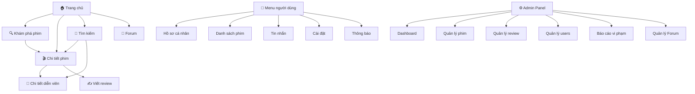
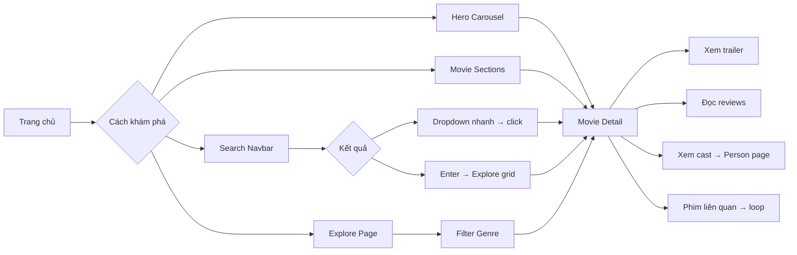
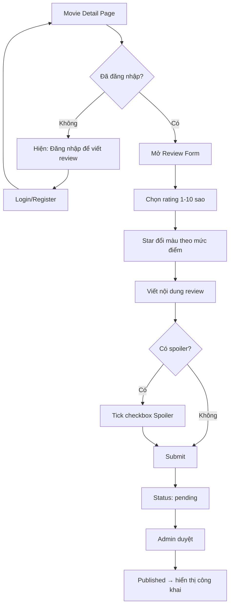
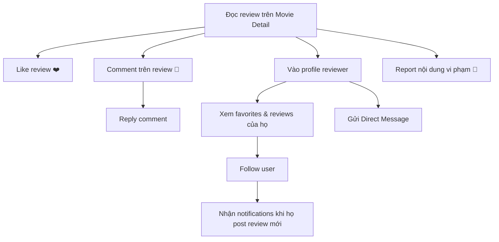
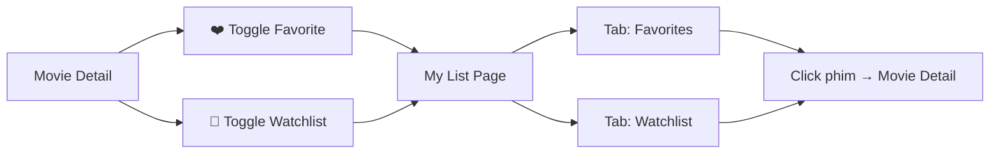
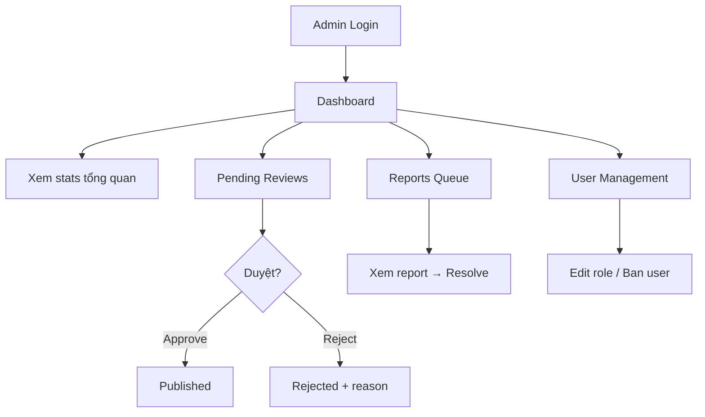

# 🎬 RecoDB — Blueprint Thiết Kế Website Review Phim

> **Tài liệu thiết kế tổng thể** cho RecoDB — cổng thông tin đánh giá phim hiện đại, xây dựng bằng Laravel.
> Tổng hợp ý tưởng từ **gocsach** (website review sách) và **azuridb** (website review phim).

---

## PHẦN 1 — TẦM NHÌN WEBSITE

### 1.1 RecoDB là gì?

**RecoDB** (Recommendation & Review Database) là một **cổng thông tin đánh giá phim kết hợp cộng đồng** — nơi người dùng Việt Nam có thể khám phá, đánh giá, và thảo luận về phim điện ảnh & phim truyền hình.

Định vị: **Letterboxd phiên bản Việt Nam** — giao diện cinematic hiện đại, cộng đồng review sôi động, tích hợp dữ liệu TMDB.

### 1.2 Đối tượng người dùng

| Nhóm | Mô tả | Nhu cầu chính |
|------|--------|---------------|
| **Cinephile** | Người yêu phim, xem phim thường xuyên | Ghi lại phim đã xem, viết review chuyên sâu, khám phá phim mới |
| **Casual Viewer** | Người xem phim giải trí | Tìm phim hay, đọc review nhanh, xem trailer |
| **Reviewer/Blogger** | Người viết review chuyên nghiệp | Xây dựng profile, thu hút followers, chia sẻ quan điểm |
| **Admin/Moderator** | Quản trị viên | Quản lý nội dung, kiểm duyệt review, xử lý báo cáo |

### 1.3 Mục tiêu website

1. **Khám phá phim** — Giúp người dùng tìm phim hay qua nhiều kênh (trending, genre, search, gợi ý)
2. **Đánh giá & Review** — Hệ thống review với rating 10 điểm, spoiler tags, và moderation workflow
3. **Cộng đồng** — Forum thảo luận, follow users, notifications, activity feed
4. **Cá nhân hóa** — Favorites, Watchlist, lịch sử review, profile tùy chỉnh
5. **Thông tin phim chính xác** — Tích hợp TMDB API cho dữ liệu phim cập nhật

### 1.4 Điểm khác biệt của RecoDB

| So với | RecoDB khác biệt ở |
|--------|-------------------|
| **TMDB** | Tập trung vào cộng đồng Việt Nam, review bằng tiếng Việt, dual rating system |
| **Letterboxd** | Giao diện tiếng Việt, forum thảo luận tích hợp, gamification (badges, challenges) |
| **Rotten Tomatoes** | Cộng đồng mở (không phân biệt critic/audience), UX hiện đại hơn |
| **IMDb** | Giao diện cinematic dark mode, trải nghiệm tập trung vào review & social |

---

## PHẦN 2 — KIẾN TRÚC WEBSITE (SITE ARCHITECTURE)

### 2.1 Sitemap tổng thể



### 2.2 Danh sách trang chi tiết

#### Trang chính (Public)

| Trang | Route | Mô tả |
|-------|-------|--------|
| **Trang chủ** | `/` | Hero carousel, trending, popular, upcoming, top rated, editor picks, forum preview |
| **Khám phá phim** | `/explore` | Search + genre filter pills + grid phim phân trang |
| **Chi tiết phim** | `/movies/{id}` | Backdrop hero, poster, rating, cast, trailer, reviews, phim liên quan |
| **Chi tiết TV** | `/tv/{id}` | Tương tự phim, thêm seasons/episodes |
| **Chi tiết diễn viên** | `/person/{id}` | Tiểu sử, ảnh, filmography |
| **Search Results** | `/search?q=` | Kết quả tìm kiếm full-page |

#### Trang người dùng (Auth Required)

| Trang | Route | Mô tả |
|-------|-------|--------|
| **Hồ sơ cá nhân** | `/profile` | Banner, avatar, badges, stats, favorites, review history |
| **Profile công khai** | `/@{username}` | Hồ sơ dạng read-only cho visitor |
| **Danh sách phim** | `/my-list` | Tabs: ❤️ Favorites / 📝 Watchlist |
| **Tin nhắn** | `/messages` | Direct messages giữa users |
| **Cài đặt** | `/settings` | Đổi thông tin, mật khẩu, preferences |
| **Thông báo** | `/notifications` | Danh sách thông báo đầy đủ |

#### Trang cộng đồng

| Trang | Route | Mô tả |
|-------|-------|--------|
| **Forum** | `/forum` | Danh sách categories & threads |
| **Forum Thread** | `/forum/{id}` | Thread chi tiết với replies |

#### Trang xác thực

| Trang | Route | Mô tả |
|-------|-------|--------|
| **Đăng nhập** | `/login` | Split-panel design, tab login/register |
| **Đăng ký** | `/register` | Password strength meter, terms agreement |
| **Quên mật khẩu** | `/forgot-password` | Email reset flow |

#### Trang quản trị (Admin Only)

| Trang | Route | Mô tả |
|-------|-------|--------|
| **Dashboard** | `/admin` | Stats tổng quan, biểu đồ, recent activity |
| **Quản lý phim** | `/admin/movies` | CRUD phim, sync TMDB |
| **Quản lý review** | `/admin/reviews` | Duyệt/từ chối review, search, filter |
| **Quản lý users** | `/admin/users` | Danh sách user, edit role, ban |
| **Quản lý Forum** | `/admin/categories` | CRUD forum categories |
| **Báo cáo vi phạm** | `/admin/reports` | Queue xử lý report |
| **Moderation** | `/admin/moderation` | Tools kiểm duyệt nội dung |

#### Trang tĩnh
`/about`, `/contact`, `/terms`, `/privacy`

### 2.3 Route Groups (4 nhóm)

```
Group 1: PUBLIC          — Trang chủ, chi tiết phim, explore, search, person
Group 2: AUTH            — Login, register, forgot password
Group 3: AUTH + VERIFIED — Write review, like, comment, follow, favorites, watchlist, messages
Group 4: AUTH + ADMIN    — Toàn bộ /admin/*
```

---

## PHẦN 3 — DANH SÁCH TÍNH NĂNG

### 3.1 Core Features

| # | Tính năng | Mô tả | Nguồn tham khảo |
|---|-----------|--------|-----------------|
| 1 | **Movie Detail Page** | Backdrop hero + poster + metadata + cast + trailer + reviews | azuridb |
| 2 | **Rating System (1-10)** | 10 sao, color-coded theo mức điểm, Vietnamese labels | azuridb |
| 3 | **Review System** | Viết review với rating, spoiler tag, character counter, moderation workflow | gocsach + azuridb |
| 4 | **Review Status Workflow** | `draft` → `pending` → `published` / `rejected` / `hidden` | gocsach |
| 5 | **Favorite Movies** | Toggle ❤️ trên trang chi tiết | azuridb |
| 6 | **Watchlist** | Toggle 📝 bookmark, tách biệt với favorites | azuridb |
| 7 | **My List** | View tổng hợp Favorites & Watchlist với tab switcher | azuridb |
| 8 | **Explore / Browse** | Search + genre filter pills + grid phân trang | azuridb |
| 9 | **Live Search** | Debounced navbar search với dropdown poster + title + year + rating | azuridb |
| 10 | **Genre Filtering** | Pill-style genre tags, click để filter | azuridb |
| 11 | **TMDB Integration** | Auto-fetch metadata, poster, backdrop, cast, trailer | azuridb |
| 12 | **Dual Rating** | Điểm cộng đồng RecoDB + điểm TMDB hiển thị song song | azuridb |
| 13 | **Trailer Playback** | YouTube embed trong cinematic modal | azuridb |
| 14 | **Person Pages** | Trang diễn viên/đạo diễn với tiểu sử + filmography | azuridb |
| 15 | **View Counting** | Session-based deduplication, đếm lượt xem phim | gocsach |

### 3.2 Community Features

| # | Tính năng | Mô tả | Nguồn |
|---|-----------|--------|-------|
| 1 | **Threaded Comments** | Comment lồng nhau với `parent_id`, AJAX loading | gocsach |
| 2 | **Forum** | Category-based discussion threads với reply counts | azuridb |
| 3 | **Forum Threads** | Tạo thread, reply, quản lý bởi admin | azuridb |
| 4 | **User Profiles** | Avatar, banner, bio, badges, stats, genre skills | gocsach + azuridb |
| 5 | **Public Profiles** | `/@username` với SEO metadata | azuridb |
| 6 | **Activity Feed** | Hoạt động gần đây của người dùng theo dõi | Letterboxd |
| 7 | **Review History** | Lịch sử tất cả review của user trên profile | gocsach + azuridb |

### 3.3 Social Features

| # | Tính năng | Mô tả | Nguồn |
|---|-----------|--------|-------|
| 1 | **Follow System** | Follow/unfollow users, follower/following counts | gocsach |
| 2 | **Like Reviews** | Like/unlike review với optimistic UI update | gocsach |
| 3 | **Like Comments** | Like comment riêng biệt | gocsach |
| 4 | **Bookmark/Save** | Save review để đọc lại | gocsach |
| 5 | **Notifications** | 9+ loại: like, comment, reply, follow, admin, report, badge, mention, message | gocsach + azuridb |
| 6 | **Direct Messages** | Nhắn tin giữa users | azuridb |
| 7 | **Report Content** | Report modal toàn cục cho review/comment vi phạm | gocsach |
| 8 | **Share Social** | Chia sẻ phim/review lên mạng xã hội | azuridb |

### 3.4 Gamification Features

| # | Tính năng | Mô tả | Nguồn |
|---|-----------|--------|-------|
| 1 | **Badges** | Huy hiệu thành tích (10 reviews, 50 favorites, etc.) | gocsach + azuridb |
| 2 | **Watch Challenges** | Thử thách xem phim theo thời gian (VD: "Review 5 phim kinh dị trong tháng") | gocsach |
| 3 | **Activity Titles** | Danh hiệu tự động: "Film Buff" → "Cinephile" → "Critic" | gocsach |
| 4 | **Avatar Frames** | Khung avatar trang trí, equip/unequip | gocsach |
| 5 | **Genre Skills** | Tag thể loại chuyên môn trên profile (max 5) | azuridb |
| 6 | **Ranking/Leaderboard** | Bảng xếp hạng reviewer theo likes | gocsach |

### 3.5 Admin Features

| # | Tính năng | Mô tả | Nguồn |
|---|-----------|--------|-------|
| 1 | **Dashboard** | Stats: users, reviews, avg score, forum activity, pending reports | azuridb |
| 2 | **Movie Management** | CRUD phim, sync từ TMDB | azuridb |
| 3 | **Review Moderation** | Duyệt/từ chối/ẩn review, search, score visualization | gocsach + azuridb |
| 4 | **User Management** | Edit user, change role, ban/unban | gocsach + azuridb |
| 5 | **Report Handling** | Queue xử lý report với resolution | gocsach + azuridb |
| 6 | **Forum Management** | CRUD categories, moderate threads | azuridb |
| 7 | **Content Moderation** | Tools kiểm duyệt: delete requests, restore, force delete | gocsach |
| 8 | **Activity Logs** | Audit trail cho mọi hành động admin | gocsach |
| 9 | **Analytics Charts** | Biểu đồ thống kê trên dashboard | gocsach |

---

## PHẦN 4 — THIẾT KẾ UI / UX

### 4.1 Design System

#### Color Palette — Dark Cinematic Theme

```
┌─────────────────────────────────────────────────┐
│  RecoDB Color System                            │
├─────────────────┬───────────────────────────────┤
│  Background     │  #0d1117  (deep dark)         │
│  Surface        │  #161b22  (elevated cards)    │
│  Surface 2      │  #1c2333  (hover states)      │
│  Primary        │  #e94560  (accent red)        │
│  Secondary      │  #f5c518  (IMDb-style gold)   │
│  Text Primary   │  #c9d1d9  (light gray)        │
│  Text Muted     │  #8b949e  (secondary text)    │
│  Success        │  #3fb950  (green)             │
│  Warning        │  #d97b2a  (orange)            │
│  Error          │  #E63946  (red)               │
│  Border         │  #30363d  (subtle borders)    │
└─────────────────┴───────────────────────────────┘
```

#### Typography

| Vai trò | Font | Usage |
|---------|------|-------|
| **Headings** | Playfair Display (serif) | Tiêu đề trang, hero text, tên phim |
| **Body** | Outfit (sans-serif) | Nội dung chính, mô tả, review text |
| **UI Elements** | Inter | Buttons, form inputs, labels, metadata |
| **Accents** | Montserrat (bold) | Section titles, badges, stats numbers |

#### Rating Color System (thang 10 điểm)

```
★ 1-4  → #E63946 (Đỏ)    → "Rất tệ" / "Tệ" / "Dưới trung bình" / "Tạm được"
★ 5-6  → #d97b2a (Cam)    → "Trung bình" / "Khá"
★ 7-8  → #2A9D8F (Xanh)   → "Tốt" / "Rất tốt"
★ 9-10 → #f5c518 (Vàng)   → "Xuất sắc" / "Kiệt tác"
```

---

### 4.2 Navbar

```
┌──────────────────────────────────────────────────────────────────┐
│  [Logo RecoDB]  [Khám phá]  [Forum]     [═══ Search ═══ 🔍]     │
│                                          [🎬 Rạp] [💬] [🔔] [👤]│
└──────────────────────────────────────────────────────────────────┘
```

**Đặc điểm:**
- **Scroll-reactive**: Thêm `backdrop-filter: blur()` khi scroll > 20px (glassmorphism)
- **Live search**: Debounced 200ms, dropdown hiển thị poster + title + year + rating + media type badge
- **Enter key**: Chuyển đến trang Explore với query
- **Conditional links**: "Danh sách", "Tin nhắn" chỉ hiện khi đã login
- **Admin link**: Chỉ hiện cho role `ADMIN`
- **Notification bell**: Badge đếm unread (max "9+"), auto-refresh 30s
- **Mobile**: Hamburger menu → slide-in sidebar với icons

---

### 4.3 Trang chủ (Homepage)

```
┌─────────────────────────────────────────────────────┐
│              🎬 HERO CAROUSEL (5 phim trending)     │
│  ┌─────────┐                                        │
│  │ Poster  │  [Badge: Phim Điện Ảnh]               │
│  │         │  Tên Phim Lớn                          │
│  │         │  2025 · ★ 8.5 · 1,200 votes           │
│  │         │  Overview text...                      │
│  │         │  [▶ Xem Trailer]  [📝 Watchlist]      │
│  └─────────┘                                        │
│  ← ● ○ ○ ○ ○ →    [thumbnail strip]               │
│  ════════════════ progress bar ═══════════════      │
├─────────────────────────────────────────────────────┤
│                                                     │
│  🔥 Trending Movies          [Xem tất cả →]       │
│  ┌────┐ ┌────┐ ┌────┐ ┌────┐ ┌────┐               │
│  │ #1 │ │ #2 │ │ #3 │ │ #4 │ │ #5 │  ← scroll →  │
│  │poster│poster│poster│poster│poster│               │
│  │★8.5│ │★7.2│ │★9.0│ │★6.8│ │★8.1│               │
│  └────┘ └────┘ └────┘ └────┘ └────┘               │
│                                                     │
│  🎭 Popular Movies           [Xem tất cả →]       │
│  [tương tự scroll section]                         │
│                                                     │
│  📺 Popular TV Shows         [Xem tất cả →]       │
│  [tương tự scroll section]                         │
│                                                     │
│  🎬 Upcoming Movies          [Xem tất cả →]       │
│  [tương tự scroll section]                         │
│                                                     │
│  ⭐ Top Rated                [Xem tất cả →]       │
│  [tương tự scroll section]                         │
│                                                     │
│  🎯 Editor's Picks           [Xem tất cả →]       │
│  [tương tự scroll section]                         │
│                                                     │
│  💬 Forum Thảo Luận Mới                            │
│  [preview 3-5 threads gần nhất]                    │
│                                                     │
├─────────────────────────────────────────────────────┤
│              FOOTER                                 │
│  [Guest CTA: "Tham gia RecoDB ngay!"]              │
└─────────────────────────────────────────────────────┘
```

**6 content sections** trên trang chủ:
1. **Trending** — phim đang hot (engagement)
2. **Popular Movies** — phim phổ biến nhất (social proof)
3. **Popular TV** — phim bộ phổ biến
4. **Upcoming** — phim sắp chiếu (anticipation)
5. **Top Rated** — phim điểm cao nhất (quality)
6. **Editor's Picks** — chọn lọc bởi admin (editorial curation)

---

### 4.4 Movie Cards

```
┌──────────────┐
│   [🎬 badge] │  ← Media type badge
│              │
│   POSTER     │  ← Aspect ratio 2:3
│   IMAGE      │
│              │
│  ┌──┐       │
│  │#1│       │  ← Rank number (optional)
│  └──┘       │
│         ★8.5│  ← Rating badge (color-coded)
├──────────────┤
│ Movie Title  │
│ 2025         │
└──────────────┘
```

**Hover state:**
- Scale 1.05 với transition 300ms
- Overlay gradient với quick info
- Quick action buttons: ❤️ Favorite, 📝 Watchlist

---

### 4.5 Movie Detail Page

```
┌─────────────────────────────────────────────────────────────────┐
│                    BACKDROP IMAGE (full-width)                  │
│  ┌──────────┐  ┌──────────────────────────────────────────────┐│
│  │          │  │ Tên Phim                                     ││
│  │  POSTER  │  │ [PG-13] · 2025 · 148 phút                  ││
│  │  (2:3)   │  │ [Hành động] [Khoa học viễn tưởng] [Phiêu lưu]│
│  │          │  │                                               ││
│  │          │  │ Overview text (expandable)...                 ││
│  │          │  │                                               ││
│  │          │  │ [▶ Xem Trailer]  [❤️ Yêu thích] [📝 Watchlist]│
│  └──────────┘  │                                               ││
│                │  ┌─ RecoDB ──┐  ┌─ TMDB ────┐               ││
│                │  │  ◐ 8.5   │  │  ◐ 7.8    │               ││
│                │  │  120 votes│  │  3.4K votes│               ││
│                │  └──────────┘  └────────────┘               ││
│                └──────────────────────────────────────────────┘│
├────────────────────────────────────┬────────────────────────────┤
│  MAIN CONTENT (8 cols)            │  SIDEBAR (4 cols)          │
│                                    │                            │
│  🎬 Đạo diễn & Biên kịch         │  📋 Thông tin              │
│  [Director bar with photos]        │  Status: Released          │
│                                    │  Language: English         │
│  👥 Diễn viên (12 người)          │  Budget: $200M             │
│  ┌────┐┌────┐┌────┐┌────┐        │  Revenue: $800M            │
│  │foto││foto││foto││foto│ scroll  │                            │
│  │name││name││name││name│        │  🎬 Trailer                │
│  │role││role││role││role│        │  [YouTube embed]           │
│  └────┘└────┘└────┘└────┘        │                            │
│                                    │  🏷️ Keywords               │
│  📸 Hình ảnh                       │  [tag] [tag] [tag]         │
│  [horizontal photo gallery]        │                            │
│                                    │  🔗 Liên kết              │
│  ✍️ Reviews                        │  [TMDB] [IMDb]             │
│  ┌───────── Viết Review ─────────┐│                            │
│  │ ★★★★★★★★★★  8/10 "Rất tốt"  ││                            │
│  │ [textarea with counter]       ││                            │
│  │ ☐ Chứa spoiler               ││                            │
│  │ [Gửi Review]                  ││                            │
│  └───────────────────────────────┘│                            │
│                                    │                            │
│  [Review Card 1]                   │                            │
│  [Review Card 2]                   │                            │
│  [Review Card 3]                   │                            │
│  [Load more...]                    │                            │
│                                    │                            │
│  🎬 Phim liên quan                │                            │
│  [horizontal scroll cards]         │                            │
└────────────────────────────────────┴────────────────────────────┘
```

---

### 4.6 Review Card

```
┌──────────────────────────────────────────────────┐
│  ┌────┐  Username           ★ 8/10  [Rất tốt]  │
│  │avatar│ @handle · 3 ngày trước                │
│  └────┘                                          │
│                                                  │
│  Review content text goes here. This is a        │
│  great movie with amazing performances...        │
│                                                  │
│  ⚠️ [Hiện nội dung spoiler]  ← nếu có spoiler  │
│                                                  │
│  ❤️ 24 likes  ·  💬 5 comments  ·  🚩 Report   │
└──────────────────────────────────────────────────┘
```

- **Score badge**: Color-coded theo thang điểm (đỏ/cam/xanh/vàng)
- **Spoiler toggle**: Blur/reveal nội dung spoiler
- **Threaded comments**: Expand để xem replies

---

### 4.7 Profile Page

```
┌─────────────────────────────────────────────────────┐
│  ═══════════════ BANNER IMAGE ═══════════════════  │
│                                                     │
│     ┌──────┐                                        │
│     │AVATAR│  Username                              │
│     │      │  @handle · "Film lover"                │
│     └──────┘  [🏅 Badge] [🏅 Badge]                │
│                                                     │
│     Genres: [Hành động] [Sci-Fi] [Kinh dị]         │
│                                                     │
│     📊 Stats:                                       │
│     42 Reviews  ·  ★ 7.8 avg  ·  156 Followers     │
│                                                     │
│     [Follow]  [Message]                             │
├─────────────────────────────────────────────────────┤
│  [❤️ Favorites] [✍️ Reviews] [📝 Watchlist]        │
├─────────────────────────────────────────────────────┤
│                                                     │
│  ┌────┐ ┌────┐ ┌────┐ ┌────┐ ┌────┐               │
│  │movie│ │movie│ │movie│ │movie│ │movie│            │
│  │card │ │card │ │card │ │card │ │card │            │
│  └────┘ └────┘ └────┘ └────┘ └────┘               │
│                                                     │
└─────────────────────────────────────────────────────┘
```

**Banner options:**
- Upload custom image
- 4 preset gradients: Aurora Warm, Deep Ocean, Neon Night, Soft Purple

**Profile edit modal:**
- Đổi name, bio, avatar (upload), banner
- Chọn genre skills (max 5)
- Equip/unequip avatar frames & badges

---

### 4.8 Explore Page

```
┌─────────────────────────────────────────────────────┐
│  🔍 Khám Phá                                       │
│                                                     │
│  [═══════════ Search input ═══════════ 🔍]         │
│                                                     │
│  Genre Pills:                                       │
│  [Tất cả] [Hành động] [Hài] [Kinh dị] [Tình cảm] │
│  [Khoa học] [Hoạt hình] [Tài liệu] [Phiêu lưu]   │
│                                                     │
│  ┌────┐ ┌────┐ ┌────┐ ┌────┐ ┌────┐               │
│  │    │ │    │ │    │ │    │ │    │               │
│  │    │ │    │ │    │ │    │ │    │               │
│  └────┘ └────┘ └────┘ └────┘ └────┘               │
│  ┌────┐ ┌────┐ ┌────┐ ┌────┐ ┌────┐               │
│  │    │ │    │ │    │ │    │ │    │               │
│  │    │ │    │ │    │ │    │ │    │               │
│  └────┘ └────┘ └────┘ └────┘ └────┘               │
│                                                     │
│  [← Prev]  Trang 1 / 10  [Next →]                 │
└─────────────────────────────────────────────────────┘
```

---

### 4.9 Auth Pages (Login / Register)

```
┌─────────────────────────────────┬───────────────────────────────┐
│                                 │                               │
│     DECORATIVE LEFT PANEL       │    [Login]  [Register]        │
│                                 │                               │
│     🎬 RecoDB Logo              │    Email: [____________]      │
│                                 │    Password: [________] 👁️   │
│     "Khám phá thế giới         │                               │
│      điện ảnh cùng cộng đồng"  │    Strength: [████░░░░]      │
│                                 │    ✓ Mật khẩu khớp           │
│     [cinematic background]      │                               │
│                                 │    ☐ Đồng ý điều khoản       │
│                                 │                               │
│                                 │    [Đăng ký →]               │
└─────────────────────────────────┴───────────────────────────────┘
```

---

### 4.10 Footer

```
┌─────────────────────────────────────────────────────────────────┐
│  ┌──────────────────────────────────────────────────────────┐  │
│  │  🎬 Bắt đầu khám phá phim cùng RecoDB!  [Đăng ký ngay] │  │ ← Guest only
│  └──────────────────────────────────────────────────────────┘  │
│                                                                 │
│  [Logo]        Gợi ý          Hỗ trợ         Pháp lý          │
│                Trending       Liên hệ        Điều khoản       │
│  RecoDB ©2025  Top Rated      FAQ            Bảo mật          │
│                Upcoming       About          Cookie           │
│                Editor Picks   Careers        Partners         │
│                                                                 │
│  ─────────────────────────────────────────────────────────────  │
│                    [watermark logo]                              │
└─────────────────────────────────────────────────────────────────┘
```

---

## PHẦN 5 — USER EXPERIENCE FLOW

### 5.1 Khám phá phim



### 5.2 Viết Review



### 5.3 Social Interaction



### 5.4 Quản lý danh sách phim



### 5.5 Admin Workflow



---

## PHẦN 6 — COMPONENT SYSTEM

### 6.1 Blade Component Architecture

```
resources/views/
├── layouts/
│   ├── app.blade.php              ← Layout chính (fonts, CSS vars, navbar, footer, toast)
│   └── admin.blade.php            ← Layout admin (sidebar + main content)
│
├── components/
│   ├── navbar.blade.php           ← Nav scroll-reactive, live search, conditional auth
│   ├── footer.blade.php           ← Footer với conditional guest CTA
│   ├── hero-carousel.blade.php    ← 5-slide hero (Alpine.js + auto-advance)
│   ├── movie-section.blade.php    ← Horizontal scroll section ($title, $items)
│   ├── movie-card.blade.php       ← Poster card ($movie, $rank)
│   ├── review-form.blade.php      ← 10-star rating form (Alpine.js)
│   ├── review-card.blade.php      ← Review display ($review)
│   ├── person-card.blade.php      ← Actor/director card ($person, $role)
│   ├── favorite-button.blade.php  ← Toggle heart (AJAX)
│   ├── watchlist-button.blade.php ← Toggle bookmark (AJAX)
│   ├── trailer-modal.blade.php    ← YouTube embed cinematic modal
│   ├── notification-dropdown.blade.php ← Bell + dropdown unread list
│   ├── rating-ring.blade.php      ← SVG circular progress ($score, $label)
│   ├── star-rating.blade.php      ← Star display component ($rating, $max)
│   ├── genre-pills.blade.php     ← Clickable genre tag list ($genres)
│   ├── expandable-text.blade.php  ← Show more/less (Alpine.js)
│   ├── spoiler-toggle.blade.php   ← Blur/reveal spoiler content
│   ├── report-modal.blade.php     ← Global report modal
│   ├── edit-profile-modal.blade.php ← Profile edit form
│   ├── toast.blade.php            ← Flash message toasts
│   ├── user-avatar.blade.php      ← Avatar + frame + badge composite
│   ├── search-dropdown.blade.php  ← Live search results dropdown
│   └── pagination.blade.php       ← Custom prev/next pagination
│
├── partials/
│   ├── movie-sidebar.blade.php    ← Sidebar thông tin phim
│   ├── cast-grid.blade.php        ← Grid 12 diễn viên
│   ├── photo-gallery.blade.php    ← Horizontal photo scroll
│   └── forum-preview.blade.php    ← Forum threads preview cho homepage
│
└── admin/
    ├── dashboard.blade.php
    ├── movies/
    ├── reviews/
    ├── users/
    ├── categories/
    ├── reports/
    └── moderation/
```

### 6.2 Component Props Reference

| Component | Props | Interactivity |
|-----------|-------|---------------|
| `movie-card` | `$movie`, `$rank?`, `$showBadge?` | Hover overlay, click navigate |
| `movie-section` | `$title`, `$subtitle?`, `$items`, `$seeAllUrl?` | Horizontal scroll, pagination dots |
| `hero-carousel` | `$movies` (5 items) | Auto-advance 5s, prev/next, dots, thumbnail strip |
| `review-form` | `$movieId` | Alpine.js: star hover, color change, counter, submit |
| `review-card` | `$review` | Like toggle, comment expand, report |
| `rating-ring` | `$score`, `$total`, `$label` | SVG animated ring |
| `favorite-button` | `$movieId`, `$isFavorited` | AJAX toggle + toast |
| `watchlist-button` | `$movieId`, `$isWatchlisted` | AJAX toggle + toast |
| `trailer-modal` | `$youtubeUrl`, `$movieTitle` | Open/close modal, backdrop blur |
| `notification-dropdown` | — (fetches via AJAX) | Auto-refresh 30s, mark read |
| `expandable-text` | `$text`, `$maxLength?` | Alpine.js toggle |
| `spoiler-toggle` | `$content` | Click to reveal |

### 6.3 JavaScript Framework

- **Alpine.js** — Client-side interactivity (carousels, modals, dropdowns, forms)
- **AJAX (fetch/axios)** — Like, favorite, watchlist, search, comment, notifications
- **CSS Transitions** — Card hover, modal animations, scroll effects
- Không sử dụng framework JS nặng (React/Vue) — giữ đơn giản với Laravel Blade + Alpine.js

---

## PHẦN 7 — TÍNH NĂNG NÂNG CAO (TÙY CHỌN)

### 7.1 Tính năng từ Letterboxd

| Tính năng | Mô tả | Độ ưu tiên |
|-----------|--------|------------|
| **Film Diary** | Ghi lại ngày xem phim + quick rating trên calendar grid | ⭐⭐⭐ |
| **Activity Feed** | Feed hoạt động gần đây của người follow | ⭐⭐⭐ |
| **User-Created Lists** | Tạo danh sách phim tùy chỉnh ("Top 10 Horror 2025") | ⭐⭐ |
| **Half-Star Ratings** | Cho phép 0.5 increments (thang 5 sao) hoặc giữ thang 10 | ⭐ |

### 7.2 Tính năng từ Rotten Tomatoes

| Tính năng | Mô tả | Độ ưu tiên |
|-----------|--------|------------|
| **Dual Rating Display** | RecoDB score vs TMDB score song song với SVG ring | ⭐⭐⭐ |
| **"Certified Fresh" Badge** | Badge tự động khi phim đạt ngưỡng review tốt | ⭐⭐ |
| **Consensus Statement** | AI-generated tóm tắt ý kiến chung về phim | ⭐ |

### 7.3 Tính năng từ TMDB

| Tính năng | Mô tả | Độ ưu tiên |
|-----------|--------|------------|
| **Collection Pages** | Nhóm phim franchise (MCU, Star Wars, etc.) | ⭐⭐ |
| **Seasonal Sections** | "Awards Season", "Summer Blockbusters", "Holiday Picks" | ⭐⭐ |
| **Contribution System** | Users submit corrections/additions to movie data | ⭐ |

### 7.4 Tính năng Gamification nâng cao

| Tính năng | Mô tả | Nguồn |
|-----------|--------|-------|
| **Watch Challenges** | Thử thách theo thời gian: "Review 5 phim kinh dị trong tháng" | gocsach |
| **Achievement Badges** | Milestones: 10 reviews, 50 favorites, 100 followers | gocsach + azuridb |
| **Activity Titles** | Danh hiệu tự động dựa trên hoạt động: "Newbie" → "Film Buff" → "Cinephile" → "Critic" → "Legend" | gocsach |
| **Avatar Frames** | Khung avatar cosmetic rewards | gocsach |
| **Leaderboard** | Bảng xếp hạng reviewer theo likes/reviews | gocsach |

### 7.5 Tính năng UX nâng cao

| Tính năng | Mô tả |
|-----------|--------|
| **Spoiler Tags** | Blur/reveal nội dung spoiler trong review |
| **Review Drafts** | Auto-save draft reviews |
| **Rich Text Editor** | WYSIWYG editor (TipTap/CKEditor) cho review |
| **Dark/Light Mode** | Toggle theme với CSS variables |
| **Skeleton Loading** | Animated placeholders khi loading content |
| **Infinite Scroll** | Alternative cho pagination trên Explore |
| **Toast Notifications** | Non-blocking feedback cho async actions |
| **Social Sharing Cards** | Open Graph images: poster + your rating |
| **SEO Structured Data** | JSON-LD cho movies và reviews |
| **Seasonal Decorations** | Auto-decorations: Oscar season, Film festivals |

---

## PHẦN 8 — ROADMAP PHÁT TRIỂN

### Phase 1 — MVP (Core Experience) ⏱️ ~4-5 tuần

> Mục tiêu: Website hoạt động với tính năng cơ bản, người dùng có thể khám phá và review phim.

| Tuần | Công việc |
|------|-----------|
| **1** | Setup Laravel, layouts, design system (colors, fonts, CSS vars), Navbar + Footer components |
| **2** | TMDB Service integration, Homepage (hero carousel + 6 movie sections), Movie cards |
| **3** | Movie Detail page (backdrop hero, cast, trailer modal, sidebar), Person detail page |
| **4** | Auth system (login/register split-panel), Review system (form + cards + rating 1-10) |
| **5** | Explore page (search + genre filter), Live search navbar, Admin dashboard cơ bản |

**Deliverables Phase 1:**
- ✅ Homepage với hero carousel + 6 sections
- ✅ Movie detail với cast, trailer, reviews
- ✅ Rating system 1-10 color-coded
- ✅ Review CRUD với moderation workflow
- ✅ Explore + Search
- ✅ Auth (login/register)
- ✅ Admin basic (dashboard, review moderation)

---

### Phase 2 — Personal & Social ⏱️ ~3-4 tuần

> Mục tiêu: Profile cá nhân, danh sách phim, social features cơ bản.

| Công việc | Chi tiết |
|-----------|----------|
| **Favorites & Watchlist** | Toggle buttons + My List page với tabs |
| **User Profile** | Banner, avatar, stats, favorites grid, review history |
| **Public Profile** | `/@username` route, SEO metadata |
| **Follow System** | Follow/unfollow, follower/following counts |
| **Notifications** | Bell dropdown, 9+ types, auto-refresh 30s |
| **Like System** | Like reviews + like comments |
| **Comment System** | Threaded comments với replies |
| **Admin mở rộng** | User management, report handling |

**Deliverables Phase 2:**
- ✅ Favorites & Watchlist
- ✅ User profiles (own + public)
- ✅ Follow system
- ✅ Notifications
- ✅ Likes & Comments
- ✅ Admin: users + reports

---

### Phase 3 — Community & Advanced ⏱️ ~3-4 tuần

> Mục tiêu: Forum cộng đồng, tính năng social nâng cao, gamification.

| Công việc | Chi tiết |
|-----------|----------|
| **Forum** | Categories, threads, replies |
| **Direct Messages** | Messaging system giữa users |
| **Dual Rating Display** | RecoDB score vs TMDB score song song |
| **Spoiler Tags** | Blur/reveal trong reviews |
| **Gamification** | Badges, activity titles |
| **Profile customization** | Banner presets, genre skills, avatar frames |
| **Activity Feed** | Show hoạt động của người follow |
| **User-Created Lists** | Tạo danh sách phim custom |
| **SEO & Performance** | Structured data, caching, lazy loading |

**Deliverables Phase 3:**
- ✅ Forum thảo luận
- ✅ Direct Messages
- ✅ Dual rating system
- ✅ Gamification (badges, titles)
- ✅ Advanced profile customization
- ✅ SEO optimization

---

## PHẦN 9 — KẾT LUẬN

### Tóm tắt Blueprint

| Khía cạnh | Chi tiết |
|-----------|----------|
| **Tổng trang** | ~25 trang (15 public + 7 admin + 3 static) |
| **Tổng tính năng** | ~50 tính năng (15 core + 7 community + 8 social + 6 gamification + 9 admin + 5 advanced) |
| **Components** | ~25 Blade components + 4 partials |
| **Route groups** | 4 nhóm (public, auth, verified, admin) |
| **Tech stack** | Laravel + Blade + Alpine.js + TMDB API + Vanilla CSS |

### Điểm mạnh của RecoDB

1. **Cinematic Design** — Dark theme, glassmorphism navbar, backdrop heroes, rating rings — trải nghiệm cao cấp
2. **Dual Rating** — Kết hợp điểm cộng đồng + TMDB → tăng uy tín và giá trị thông tin
3. **Cộng đồng Việt Nam** — Review tiếng Việt, labels tiếng Việt, giao diện thân thiện
4. **Gamification** — Badges, challenges, titles, frames → khuyến khích engagement dài hạn
5. **Moderation Workflow** — Review được duyệt bởi admin → chất lượng nội dung cao
6. **Kiến trúc rõ ràng** — Component-based Blade, 4 route groups, admin namespace tách biệt → dễ phát triển và bảo trì
7. **TMDB Integration** — Dữ liệu phim chính xác, cập nhật, không cần nhập thủ công
8. **Social Features đầy đủ** — Follow, like, comment, notify, message → xây dựng cộng đồng bền vững

### Định hướng phát triển

RecoDB được thiết kế để phát triển **từ MVP đến full-featured** theo 3 phase rõ ràng. Mỗi phase đều có giá trị sử dụng độc lập — Phase 1 đã là một website review phim hoàn chỉnh, Phase 2 thêm yếu tố cá nhân hóa, Phase 3 mở rộng thành cộng đồng.

> **Nguyên tắc thiết kế:**
> - Mobile-first responsive
> - Dark cinematic aesthetic
> - Performance-first (lazy loading, caching, AJAX)
> - SEO-friendly (structured data, semantic HTML)
> - Accessibility (ARIA labels, keyboard navigation)
